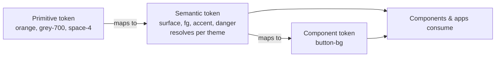

# Eidra Design System

The shared design language and component library Eidra uses to build web apps — internal tools, client-facing SaaS, marketing sites, and pitch demos. Built on Base UI (headless, accessible primitives) with Eidra's brand layered on top through design tokens.

## Language

### Tokens

**Token**:
A named design value (color, size, type, etc.) and the single source of truth for that value. Authored in DTCG JSON, built to CSS custom properties and typed TS constants.
_Avoid_: variable, constant (when referring to design values)

**Primitive token**:
A raw, context-free brand value — e.g. `orange`, `grey-700`, `space-4`. Never themed; never consumed directly by components.
_Avoid_: base token, global token

**Semantic token**:
A role-based token that maps to a primitive and changes per theme — e.g. `surface`, `fg`, `border`, `accent`, `danger`. The layer components and apps consume.
_Avoid_: alias token (use only when describing the mapping mechanism)

**Component token**:
A token scoped to one component that maps to a semantic token — e.g. `button-bg`. Used when a component needs a value that may diverge from the generic semantic.

### Brand

**Eidra Sans**:
The brand typeface and the only font family in the system. Shipped as woff/woff2 via `@font-face`.

**Creme** (`#F5F2EC`):
The warm off-white brand neutral. The signature page background in expressive contexts.
_Avoid_: cream, off-white, ivory

**Taupe** (`#7A756E`):
The warm grey-brown brand neutral.
_Avoid_: brown, mushroom

**Coral** (`#FF6F61`):
The warm red accent (`coral-500`). Distinct from `danger`, which is a semantic role.
_Avoid_: salmon, red

**Orange** (`#FAA21B`):
The primary brand accent.
_Avoid_: amber, yellow, gold

### Tiers

**Product tier**:
The default foundation — conventional type ramp (Regular/Medium/Semibold/Bold from 12px) and a 4px spacing grid. Optimized for functional density. This is what components are built on.
_Avoid_: app tier, UI tier

**Display tier**:
The brand's editorial scale — large bold type (up to 136/184px), tight tracking, coarse spacing. Used for expressive/marketing surfaces as deliberate overrides, not the product default.
_Avoid_: marketing tier, hero tier

**Density**:
A setting that scales spacing/sizing of components — `comfortable` (default) vs `compact` (dense dashboards). One set of components, not a fork.
_Avoid_: size mode, scale mode
