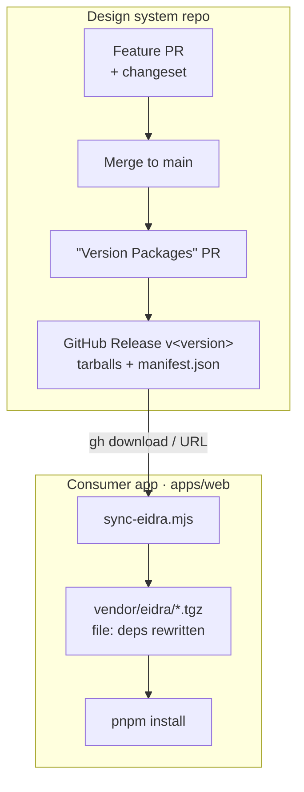

# Consuming the Eidra Design System

The packages aren't published to a registry yet. They're distributed as **versioned tarballs** that consuming apps reference with `file:` dependencies. A version bump changes the tarball filename, which changes the `file:` path, which forces a clean reinstall — so updates are deterministic (no stale cache).

This guide uses **frankly** (`apps/web`, Next.js App Router) as the example consumer.

> **Repo:** [github.com/mattwakeman-eidra/eidra-design-system](https://github.com/mattwakeman-eidra/eidra-design-system) · **Storybook:** [mattwakeman-eidra.github.io/eidra-design-system](https://mattwakeman-eidra.github.io/eidra-design-system/) (browse every component and its props without checking out the repo).

---

## 1. How releases are produced

The design system is released through **GitHub Releases** — each release attaches the packed tarballs (`eidra-*-<version>.tgz`) and `manifest.json` as assets. Releases are PR-driven (see ADR-0004):

1. A feature PR includes a changeset: `pnpm changeset` (describe the bump). CI fails the PR without one.
2. Merge to `main` → the bot opens a **"Version Packages" PR** (bumps versions + changelogs).
3. Merge that PR → GitHub Actions builds, packs, and publishes a **GitHub Release `v<version>`** with the tarballs attached.



> Local/offline: `pnpm release` packs the same tarballs into `./releases/` without GitHub, for inner-loop testing.

## 2. Wire up the consumer (one-time)

Copy `templates/sync-eidra.mjs` from the design system into the consumer at `apps/web/scripts/sync-eidra.mjs`. Adjust the path constants at the top if your layout differs (defaults assume `apps/web/package.json`).

Then, from `apps/web`, pull a release. Use whichever matches the repo's visibility:

```bash
# From a GitHub Release (needs the `gh` CLI, authenticated).
node scripts/sync-eidra.mjs mattwakeman-eidra/eidra-design-system            # latest release
node scripts/sync-eidra.mjs mattwakeman-eidra/eidra-design-system v0.1.2     # a specific tag

# …or from a local releases dir (offline):
node scripts/sync-eidra.mjs /path/to/eidra-design-system/releases
```

This downloads/copies the tarballs into `apps/web/vendor/eidra/`, rewrites the `@eidra/*` `file:` deps to that version, and runs `pnpm install`. Your `package.json` ends up with:

```jsonc
"dependencies": {
  "@eidra/tokens": "file:vendor/eidra/eidra-tokens-0.1.2.tgz",
  "@eidra/icons":  "file:vendor/eidra/eidra-icons-0.1.2.tgz",
  "@eidra/react":  "file:vendor/eidra/eidra-react-0.1.2.tgz"
}
```

Commit `vendor/eidra/*.tgz` so teammates and CI install the same bytes.

**Public-repo shortcut (no vendoring):** if the design-system repo is public, skip the script and point directly at the release-asset URLs — pnpm installs tarballs from a URL and pins them in the lockfile:

```jsonc
"@eidra/react":  "https://github.com/mattwakeman-eidra/eidra-design-system/releases/download/v0.1.2/eidra-react-0.1.2.tgz",
"@eidra/tokens": "https://github.com/mattwakeman-eidra/eidra-design-system/releases/download/v0.1.2/eidra-tokens-0.1.2.tgz",
"@eidra/icons":  "https://github.com/mattwakeman-eidra/eidra-design-system/releases/download/v0.1.2/eidra-icons-0.1.2.tgz"
```

## 3. Updating later

Re-run the sync with the new tag (or `latest`):

```bash
node scripts/sync-eidra.mjs mattwakeman-eidra/eidra-design-system v0.1.3
```

The version-stamped filename changes, so pnpm reinstalls the new code — no `--force`. (URL-dep consumers just bump the version in the three URLs.)

---

## 4. Load the styles and theme (Next.js App Router)

In `apps/web/src/app/layout.tsx`. frankly already loads Eidra Sans via `next/font/local`, so we **reuse that** and point the design system's font token at it (no second font download):

```tsx
import type { ReactNode } from 'react'
import { eidraSans } from './fonts'
import '@eidra/react/styles.css' // tokens + reset + all component styles (one global import)

export const metadata = { title: 'Frankly', description: '…' }

export default function RootLayout({ children }: { children: ReactNode }) {
  return (
    <html lang="en" className={eidraSans.variable}>
      <body
        className="eidra-root"
        data-theme="light"
        data-density="comfortable"
        style={{ margin: 0, ['--eidra-font-family-sans' as string]: 'var(--font-eidra-sans), system-ui, sans-serif' }}
      >
        {children}
      </body>
    </html>
  )
}
```

- `@eidra/react/styles.css` is the single global stylesheet (must be imported in a layout in the App Router). It ships inside a cascade layer, **`@layer eidra`**, so your own styles win: unlayered CSS and Tailwind utilities override DS rules via `className` — no inline `style` needed. Import it **before** Tailwind's utilities (see §5) so the `eidra` layer registers first (lower priority). See ADR-0008.
- `class="eidra-root"` + `data-theme` establishes the theme scope; switch to `data-theme="dark"` for dark mode.
- The inline `--eidra-font-family-sans` override makes every component use frankly's already-optimized `next/font` Eidra Sans.

**Apps without their own font setup** can skip the override and instead `import '@eidra/tokens/fonts.css'` — that ships the Eidra Sans `@font-face` declarations and woff2 files.

For a runtime light/dark toggle, use the `ThemeProvider` component (a client component) around a subtree, or toggle `data-theme` on the body with your own state.

---

## 5. Use the tokens with Tailwind (optional)

If your app uses Tailwind, wire in the Eidra tokens so they're available as utilities — no inline `style={{ … var(--eidra-*) }}` just to reach a token. The utilities reference the CSS variables, so they stay theme-reactive (light / dark / finance) automatically. **Pick the entry that matches your Tailwind major** — v4 dropped JS-preset config, so the two are wired in completely differently.

### Tailwind v4 (CSS-first) — `@eidra/react/tailwind.css`

Tailwind v4 configures the theme in CSS, not a `tailwind.config.js`. Import the generated theme bridge after Tailwind itself:

```css
/* your globals.css */
@import '@eidra/react/styles.css';   /* @layer eidra: --eidra-* variables + component styles */
@import 'tailwindcss';               /* utilities land in @layer utilities (after eidra) */
@import '@eidra/react/tailwind.css';  /* maps the tokens onto Tailwind's v4 @theme */
```

**Order matters:** keep `@eidra/react/styles.css` first. It declares `@layer eidra`, so importing it before `tailwindcss` registers `eidra` below Tailwind's `utilities` layer, which is what lets a utility like `w-24` or `border-0` override a DS rule on a component (e.g. `<Select.Trigger className="w-24" />`). Your own unlayered CSS beats both.

`@eidra/react/tailwind.css` (identical to `@eidra/tokens/tailwind.css`) is **generated from the tokens**, so it never drifts. It maps each token onto Tailwind v4's theme namespaces (`--color-*`, `--spacing-*`, `--radius-*`, `--shadow-*`, `--font-*`, `--text-*`, `--font-weight-*`, `--leading-*`, `--tracking-*`, `--ease-*`) inside `@theme inline`, so utilities resolve to the live `var(--eidra-*)` value. This adds the Eidra tokens **alongside** Tailwind's built-in theme.

#### Optional: Eidra-only utilities (`@eidra/react/tailwind-reset.css`)

By default the bridge leaves Tailwind's built-in theme in place, so both Tailwind's defaults (`p-4`, `bg-red-500`, …) and the Eidra tokens generate utilities. If you want **only** Eidra tokens to generate utilities (so devs can't reach for off-system colours/spacing), opt in to the reset — it's a separate import so the design system enables this rather than forcing it. Import it **after** `tailwindcss` and **before** the bridge:

```css
@import '@eidra/react/styles.css';
@import 'tailwindcss';
@import '@eidra/react/tailwind-reset.css';  /* opt-in: drops Tailwind's default theme */
@import '@eidra/react/tailwind.css';        /* re-adds only the Eidra tokens */
```

The reset is just `@theme { --*: initial }`; order matters, since it clears all theme namespaces and the bridge then re-adds the Eidra ones. Omit the import to keep Tailwind's defaults alongside Eidra's.

### Tailwind v3 (JS preset) — `@eidra/tokens/tailwind`

```js
// tailwind.config.js  (Tailwind v3)
module.exports = {
  presets: [require('@eidra/tokens/tailwind')],
  content: ['./src/**/*.{ts,tsx}'],
}
```

You still load the CSS variables once (via `@eidra/react/styles.css` or `@eidra/tokens/css`); the preset only maps utilities onto `var(--eidra-*)`. Every token becomes an `eidra-`-prefixed utility:

| Token family | Example utilities | Resolves to |
| --- | --- | --- |
| Colour | `bg-eidra-accent`, `text-eidra-fg-muted`, `border-eidra-finance-accent` | `var(--eidra-accent)` … |
| Spacing | `p-eidra-4`, `gap-eidra-2`, `h-eidra-control-md` | `var(--eidra-space-4)` … |
| Radius | `rounded-eidra-lg` | `var(--eidra-radius-lg)` |
| Shadow | `shadow-eidra-md` | `var(--eidra-shadow-md)` |
| Type | `font-eidra-sans`, `text-eidra-sm` | `var(--eidra-font-family-sans)` … |
| Z-index | `z-eidra-modal` | `var(--eidra-z-modal)` |

The preset uses `theme.extend`, so Tailwind's built-in utilities keep working alongside the Eidra ones.

> **Caveat (both):** because the colours are `var()` references, Tailwind's opacity modifier (`bg-accent/50`, `bg-eidra-accent/50`) has no effect — reach for a `-subtle` token variant instead.

---

## 6. Example pages with controls

Two ready-to-paste pages live in the design system under `templates/examples/`. Drop them into frankly at `apps/web/src/app/design/` and visit `/design`.

### `app/design/page.tsx` — component showcase

```tsx
'use client'

import { Typography, Button, Badge, Alert, Card, Separator, Tabs } from '@eidra/react'
import { ArrowRight, Plus } from '@eidra/icons'
import { Icon } from '@eidra/icons'

export default function DesignShowcase() {
  return (
    <main style={{ maxWidth: 880, margin: '0 auto', display: 'grid', gap: 'var(--eidra-space-8)' }}>
      <header style={{ display: 'grid', gap: 'var(--eidra-space-2)' }}>
        <Typography variant="display-md">Eidra UI</Typography>
        <Typography variant="body-lg" tone="muted">
          The shared component language for Eidra web apps.
        </Typography>
      </header>

      <Card padding="lg">
        <Card.Header>
          <Typography variant="heading-3">Buttons</Typography>
        </Card.Header>
        <Card.Body>
          <div style={{ display: 'flex', flexWrap: 'wrap', gap: 'var(--eidra-space-3)' }}>
            <Button>Primary</Button>
            <Button variant="outline">Outline</Button>
            <Button variant="ghost">Ghost</Button>
            <Button tone="coral">Coral</Button>
            <Button tone="danger" variant="subtle">Danger</Button>
            <Button startIcon={<Icon icon={Plus} />}>Create</Button>
            <Button endIcon={<Icon icon={ArrowRight} />}>Continue</Button>
            <Button loading>Saving…</Button>
          </div>
        </Card.Body>
      </Card>

      <Card padding="lg">
        <Card.Header>
          <Typography variant="heading-3">Badges & feedback</Typography>
        </Card.Header>
        <Card.Body style={{ display: 'grid', gap: 'var(--eidra-space-4)' }}>
          <div style={{ display: 'flex', gap: 'var(--eidra-space-2)', flexWrap: 'wrap' }}>
            <Badge tone="accent">Active</Badge>
            <Badge tone="success" variant="subtle">Synced</Badge>
            <Badge tone="warning" variant="subtle">Pending</Badge>
            <Badge tone="danger" variant="outline">Failed</Badge>
          </div>
          <Separator />
          <Alert tone="info" title="Heads up">
            Connect a data source to start syncing.
          </Alert>
          <Alert tone="success" title="All set" dismissible>
            Your changes were saved.
          </Alert>
        </Card.Body>
      </Card>

      <Card padding="lg">
        <Card.Header>
          <Typography variant="heading-3">Tabs</Typography>
        </Card.Header>
        <Card.Body>
          <Tabs.Root defaultValue="overview">
            <Tabs.List>
              <Tabs.Tab value="overview">Overview</Tabs.Tab>
              <Tabs.Tab value="activity">Activity</Tabs.Tab>
              <Tabs.Tab value="settings">Settings</Tabs.Tab>
              <Tabs.Indicator />
            </Tabs.List>
            <Tabs.Panel value="overview" style={{ paddingTop: 'var(--eidra-space-4)' }}>
              <Typography>Overview content.</Typography>
            </Tabs.Panel>
            <Tabs.Panel value="activity" style={{ paddingTop: 'var(--eidra-space-4)' }}>
              <Typography>Recent activity.</Typography>
            </Tabs.Panel>
            <Tabs.Panel value="settings" style={{ paddingTop: 'var(--eidra-space-4)' }}>
              <Typography>Settings.</Typography>
            </Tabs.Panel>
          </Tabs.Root>
        </Card.Body>
      </Card>
    </main>
  )
}
```

### `app/design/settings/page.tsx` — a form with controls

```tsx
'use client'

import { useState } from 'react'
import { Typography, Card, Field, Input, Switch, Button, Separator } from '@eidra/react'

export default function SettingsForm() {
  const [notify, setNotify] = useState(true)

  return (
    <main style={{ maxWidth: 560, margin: '0 auto' }}>
      <Card padding="lg">
        <Card.Header style={{ display: 'grid', gap: 'var(--eidra-space-1)' }}>
          <Typography variant="heading-2">Workspace settings</Typography>
          <Typography variant="body-sm" tone="muted">Manage how your workspace behaves.</Typography>
        </Card.Header>
        <Card.Body style={{ display: 'grid', gap: 'var(--eidra-space-5)' }}>
          <Field label="Workspace name" hint="Shown to everyone in the workspace.">
            <Input defaultValue="Eidra" />
          </Field>
          <Field label="Billing email" error="Enter a valid email address.">
            <Input type="email" defaultValue="not-an-email" />
          </Field>
          <Separator />
          <Switch.Root checked={notify} onCheckedChange={setNotify} label="Email me about sync failures">
            <Switch.Thumb />
          </Switch.Root>
        </Card.Body>
        <Card.Footer style={{ display: 'flex', justifyContent: 'flex-end', gap: 'var(--eidra-space-3)' }}>
          <Button variant="ghost" tone="neutral">Cancel</Button>
          <Button>Save changes</Button>
        </Card.Footer>
      </Card>
    </main>
  )
}
```

> The full, exact API for every component (Select, Dialog, Combobox, Menu, etc.) is in Storybook — browse it at **[mattwakeman-eidra.github.io/eidra-design-system](https://mattwakeman-eidra.github.io/eidra-design-system/)**, or run `pnpm storybook` in the design system. Each component's stories show its compound parts and props.

---

## 7. Teaching an AI agent to use the design system

The package ships an agent catalog at **`node_modules/@eidra/react/llms.txt`** (every component, its imports, compound parts, and a one-line description) and exact prop types at **`node_modules/@eidra/react/dist/index.d.ts`**. An agent that reads those two files can write correct code without guessing.

Add a section to the consumer's `CLAUDE.md` (or `AGENTS.md`) so the agent knows they exist and how to set up:

```md
## Eidra Design System (@eidra/react)

UI is built with the Eidra Design System. Before writing UI:
- Read `node_modules/@eidra/react/llms.txt` for the component catalog (what exists, imports, compound parts).
- Read `node_modules/@eidra/react/dist/index.d.ts` for exact prop types — it is the source of truth.

Rules:
- Components: `import { Button, Field, Input, ... } from '@eidra/react'`. Icons: `import { Icon, ChevronDown } from '@eidra/icons'`.
- Global styles + theme scope are set once in `src/app/layout.tsx` (`@eidra/react/styles.css`, `class="eidra-root" data-theme=…`). Don't re-import styles per page.
- Style with token CSS variables (`var(--eidra-space-4)`, `var(--eidra-fg)`), never raw colors/spacing. Token names are listed in `llms.txt`.
- Compound components are namespaces — render the parts listed in the catalog (e.g. `<Dialog.Root><Dialog.Trigger/>…`). A `GroupLabel` must sit inside its `Group`.
- Prefer existing components over new CSS. Match the density of the surrounding page.
```

When the design system is updated (`node scripts/sync-eidra.mjs`), the refreshed `llms.txt` comes with the new tarball — the agent's reference stays current automatically.

## Notes

- **`apps/web` boundary:** these are UI packages (no `@frankly/api` import), so they respect frankly's layer rules.
- **`"use client"`:** `@eidra/react` ships with a client boundary baked in, so importing it from server components in the App Router is safe.
- **Standalone output:** `next.config.ts` already traces from the monorepo root, so the vendored packages are included in the standalone build.
