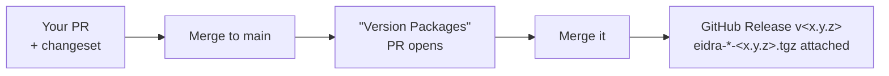

# Releasing the Eidra Design System

Releases are **tarballs attached to a GitHub Release**, driven by Changesets and GitHub Actions. The three packages (`@eidra/tokens`, `@eidra/icons`, `@eidra/react`) are a fixed group — they always release together under one version. See ADR [`0004`](./adr/0004-github-releases-distribution.md).

## TL;DR



You never bump versions or pack tarballs by hand — merging the two PRs does it.

## Normal release (the click-path)

1. **On your feature branch**, after making changes, add a changeset:
   ```bash
   pnpm changeset
   ```
   Pick the bump (`patch` for fixes, `minor` for new components/props, `major` for breaking changes) and write a one-line summary. This creates a file under `.changeset/`. Commit it with your change.

2. **Open your PR.** CI (`ci.yml`) runs typecheck + build and **fails if no changeset is present**. Get it reviewed and merge to `main`.

3. **The bot opens a "Version Packages" PR** (workflow `release.yml`). It bumps all three `package.json` versions and writes `CHANGELOG.md` entries from the changesets. Review it like any PR — the diff is just versions + changelog.

4. **Merge the "Version Packages" PR.** That triggers the publish step, which builds, regenerates the catalog, packs the tarballs, and creates **GitHub Release `v<version>`** with `eidra-tokens-<v>.tgz`, `eidra-icons-<v>.tgz`, `eidra-react-<v>.tgz`, and `manifest.json` attached.

Done — the release is live on the repo's **Releases** page.

## First release (bootstrapping a new repo)

1. Create the GitHub repo (any owner — the `@eidra` scope is unaffected), then push `main`.
2. The default `GITHUB_TOKEN` already has the `contents: write` + `pull-requests: write` permissions the workflows request — no secrets to configure.
3. With no changesets present, the first push to `main` runs the publish step on the **current version** (e.g. `v0.1.1`) and creates that release automatically. From then on, use the normal flow above.

## Local / offline (no GitHub)

For inner-loop testing or air-gapped work, produce the same tarballs without GitHub:

```bash
pnpm release          # build + catalog + pack ./releases/eidra-*-<version>.tgz + manifest.json
pnpm release:github   # the above, then create the GitHub Release (needs an authenticated gh CLI)
```

`pnpm version-packages` applies any pending changesets locally if you want to bump versions outside CI.

## Consumers get the update

Apps pull a release with the sync script (see [CONSUMING.md](./CONSUMING.md)):

```bash
node scripts/sync-eidra.mjs mattwakeman-eidra/eidra-design-system v<version>
```

## Troubleshooting

- **CI fails: "No changesets present"** — your PR changed a package but has no changeset. Run `pnpm changeset` and commit it.
- **No "Version Packages" PR appeared** — there were no changesets on `main`, so nothing to version. Add one in a PR.
- **Release step did nothing** — `github-release.mjs` is idempotent; if a release for that version already exists it skips. Bump the version (new changeset) to cut a new one.
- **Version mismatch error from `pnpm release`** — the three packages drifted. They must share a version; run `pnpm version-packages` (or align them) before packing.
- **Changesets/`gh` need git + network** — these run in CI by design; locally they require a git repo and an authenticated `gh`.
