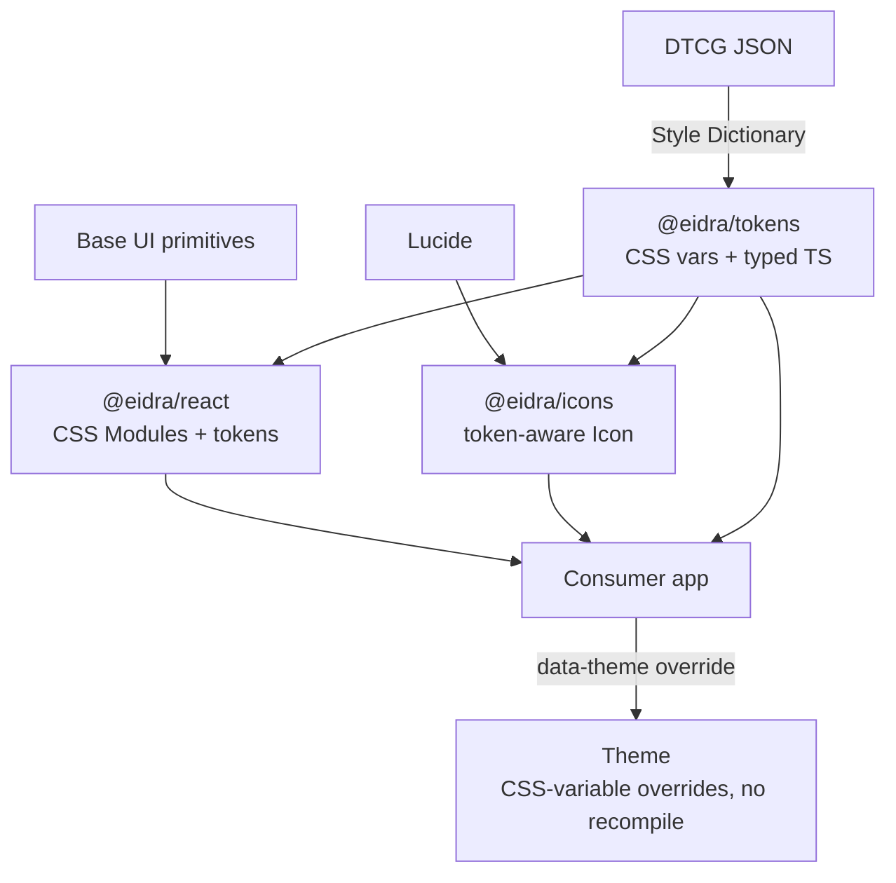

# Architecture and stack

We build the Eidra Design System as a **pnpm monorepo** of versioned packages — `@eidra/tokens`, `@eidra/react`, `@eidra/icons`, plus shared config — rather than a single package, so apps can consume tokens (and non-React surfaces) independently of the React layer.

Components wrap **Base UI** (headless, accessible primitives) — we own styling, not behavior/a11y. Styling is **CSS Modules + CSS custom properties**, compiled to a plain stylesheet consumers import: zero runtime, SSR/RSC-safe, and no bundler coupling for consuming apps. Themes are CSS-variable overrides, never recompiled CSS.

Tokens are authored once in **DTCG JSON** and built with **Style Dictionary** to CSS custom properties + typed TS constants. `@eidra/icons` wraps **Lucide** behind a token-aware `<Icon>`.

## Considered Options

- **Tailwind / vanilla-extract / runtime CSS-in-JS** for styling — rejected: Tailwind couples every consumer to its build; vanilla-extract adds a bundler plugin; runtime CSS-in-JS has RSC friction and runtime cost.
- **Single package / copy-paste (shadcn) model** — rejected: weaker cross-app brand consistency and versioning.

## Consequences

- Consumers import a prebuilt CSS file and theme via a `data-theme` attribute.
- Not published to a registry — packages are built publish-ready (scoped `@eidra/*`, ESM-first, tree-shakable `exports`, Changesets-ready). Distribution was resolved later in [ADR-0003](./0003-versioned-tarball-distribution.md) / [ADR-0004](./0004-github-releases-distribution.md): **versioned tarballs attached to GitHub Releases — no registry.** (GitHub Packages was considered and rejected — see [ADR-0006](./0006-github-packages-release-flow.md).)
